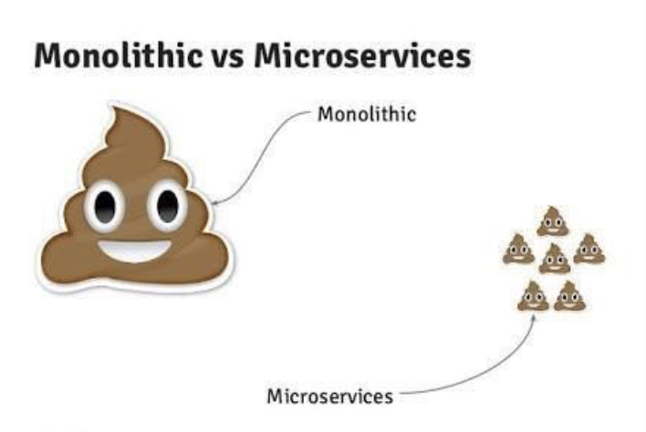

## A

- [leetcode 13 easy:Roman to Integer](https://leetcode.com/problems/roman-to-integer/)

- 时间复杂度：O(n)
- 空间复杂度：O(1)
- PS：注意IV、IX、XL、XC、CD、CM的特殊处理。这里的实现是直接写在映射表里的，也可以单独取出来之后做减法得到对应的整数。

```java

class Solution {
    
    public int romanToInt(String s) {
        
        // 罗马数字到整数的映射表
        Map<String,Integer> map = new HashMap();
        map.put("I",1);
        map.put("V",5);
        map.put("X",10);
        map.put("L",50);
        map.put("C",100);
        map.put("D",500);
        map.put("M",1000);
        map.put("IV",4);
        map.put("IX",9);
        map.put("XL",40);
        map.put("XC",90);
        map.put("CD",400);
        map.put("CM",900);
        
        // 定义整数
        int result = 0;
        
        for(int i=0;i<s.length();i++){
            
            // 取 i 所在位置的单个字符
            String romanCurrent = s.substring(i,i+1);
            
            // 最后一个字符特殊处理，什么都不用管，直接取数字加上去就行了
            if(i==s.length()-1){
                result += map.get(romanCurrent);
                break;
            }
            
            // 如果不是最后一个字符，则取下一个，比较大小。
            // 若左边<右边，则两个字符组合映射整数；否则单独用当前字符映射整数。
            String romanNext = s.substring(i+1,i+2);
            if(map.get(romanCurrent) >= map.get(romanNext)){
                result += map.get(romanCurrent);
            }else{
                result += map.get(s.substring(i,i+2));
                i++;// 注意，由于这里是把当前字符和下一个字符组合计算了，所以要 i++ 跳过 next
            }
            
        }
        return result;

    }
}
```


## R
- [Pattern: Monolithic Architecture](https://microservices.io/patterns/monolithic.html)
- [Pattern: Microservice Architecture](https://microservices.io/patterns/microservices.html)
- 这是第二周的 R 读的 [A pattern language for microservices](https://microservices.io/patterns/microservices.html) 的两篇子文章，分别介绍了“单体架构”和“微服务架构”。

小结：
- 单体架构的特点是：易于开发部署和扩展，然而规模扩大后，应用扩展、持续部署、规模化开发、技术栈变迁都变得困难无比。
- 微服务架构的特点是：每项微服务相对较小，每项服务皆可独立于其他服务进行部署，易于实现模块化开发，不存在单点故障问题，技术栈升级或变迁也会相对容易；但是部署复杂，内存占用量更高，模块拆分也带来更多额外的复杂的问题。
- 在 Microservice 这篇文章中，提出了一些方法和模式，作为微服务架构设计的指导思想。我目前还理解的不是很透彻，需要多花点时间看看。
- 让我不禁想到了一张十分形象生动的对比图：


## T
现学现卖，markdown插入图片，第一次用，捂脸。

```

```


## S

这周末上了两天线下算法大课，确实是没有其他的新东西输入，先分享一篇以前写的存货：[你到底行不行，字符集踩坑小记](https://www.jianshu.com/p/62c56d75c18b)


然后想分享一下这两天上课的心得。

我个人是计算机科班出身，大学的时候数据结构与算法学的还不错，但研究生学贪心动规分治回溯就明显比较吃力了，所以这部分一直是我的短板，尤其是动规，遇到就懵。

这两天的课程下来，除了贪心和动规，其他的知识点都能听懂（但能不能写出来就另说了）。

比较深刻的体会是：
1. 算法没有“速成”方法，陈晧老师已经讲的非常好了，但最终还是要靠个人去消化和理解。
2. 搞不定动规的不只是我一个人，很厉害的同学们，还有老师，也有搞不定的，所以感觉我还可以再抢救一下，哈哈哈哈。
3. 最后是理论知识的补齐，光靠刷题没用，还是要深入理解原理，搞明白解题思路，不能只是背下答案就完事儿了。
